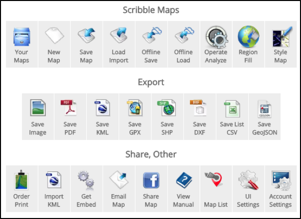
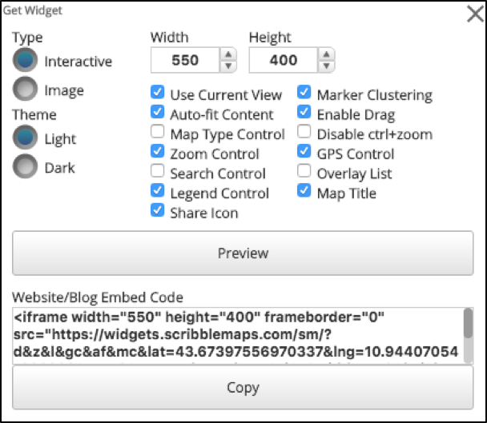
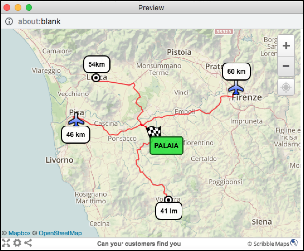

+++
title = "Can your customers find you?"
subtitle = ""

# Add a summary to display on homepage (optional).
summary = ""

date = 2019-03-15T12:21:24+01:00
draft = false

# Authors. Comma separated list, e.g. `["Bob Smith", "David Jones"]`.
authors = ["admin"]

# Is this a featured post? (true/false)
featured = false

# Tags and categories
# For example, use `tags = []` for no tags, or the form `tags = ["A Tag", "Another Tag"]` for one or more tags.
tags = ["ScribbleMaps"]
categories = []

# Projects (optional).
#   Associate this post with one or more of your projects.
#   Simply enter your project's folder or file name without extension.
#   E.g. `projects = ["deep-learning"]` references
#   `content/project/deep-learning/index.md`.
#   Otherwise, set `projects = []`.
# projects = ["internal-project"]

# Featured image
# To use, add an image named `featured.jpg/png` to your page's folder.
[image]
  # Caption (optional)
  caption = "Image credit: [**ScribbleMaps*](https://www.scribblemaps.com/)"

  # Focal point (optional)
  # Options: Smart, Center, TopLeft, Top, TopRight, Left, Right, BottomLeft, Bottom, BottomRight
  focal_point = ""

  # Show image only in page previews?
  preview_only = true

+++

The Christmas holidays are upon us. It’s time for shopping and relaxation. Commercial activities are in full swing. Advertisements flood TV, newspapers, and radio with a ton of last-minute promotions.

If you are a new business and you would like to advertise an event to attract new customers, you will sure to be found.  

Scribble Maps will make your life easier and help you create a map that can be shared on your digital channels, like social media, your website, and WhatsApp, with directions to your business.

Imagine that your business is in a small town in the Tuscan countryside that only the locals know. You have to look for a way to draw as many customers to you as you can.

In order to do this, you should consider major cities or populated areas around you. In this case the airports of Pisa and Florence and the cities of Lucca and Volterra. By entering the appropriate markers (nearby cities and airports) into Scribble Maps, you can bring potential customers to you.

Use the “Creating Directions feature” by entering a starting point, such as the Pisa airport, and set your business’s address as the destination. Repeat the same procedure for any remaining markers, like Lucca and Volterra.

Now, you have the final map containing all the information that you need.
How can we share it with other users?
We can include the map on the home page by following simple steps:

* Choose Widget/embed from the Menu Toolbar

* Choose the map size

* Click preview to show how the map will appear like

Scribble Maps can also be used to create simple and easy maps with directions to any business or even your next event.  Give directions to your favorite farmhouse. Or try it out for your wedding party.

In any case, share your experiences with us!
