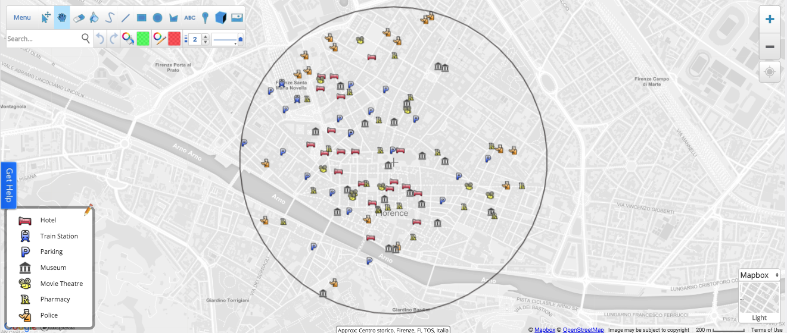

+++
title = "Geomarketing Market Research"
subtitle = ""

# Add a summary to display on homepage (optional).
summary = ""

date = 2019-03-15T12:20:49+01:00
draft = false

# Authors. Comma separated list, e.g. `["Bob Smith", "David Jones"]`.
authors = ['admin']

# Is this a featured post? (true/false)
featured = false

# Tags and categories
# For example, use `tags = []` for no tags, or the form `tags = ["A Tag", "Another Tag"]` for one or more tags.
tags = ["ScribbleMaps"]
categories = []

# Projects (optional).
#   Associate this post with one or more of your projects.
#   Simply enter your project's folder or file name without extension.
#   E.g. `projects = ["deep-learning"]` references
#   `content/project/deep-learning/index.md`.
#   Otherwise, set `projects = []`.
# projects = ["internal-project"]

# Featured image
# To use, add an image named `featured.jpg/png` to your page's folder.
[image]
  # Caption (optional)
  caption = "Image credit: [**ScribbleMaps*](https://www.scribblemaps.com/)"

  # Focal point (optional)
  # Options: Smart, Center, TopLeft, Top, TopRight, Left, Right, BottomLeft, Bottom, BottomRight
  focal_point = ""

# Show image only in page previews?
preview_only = true

# Set captions for image gallery.
+++

Today we are going to show you some real examples on one of the most advanced functionalities of Scribble Maps:

* Nearby Search.

Any time you have to travel to a new city, you would like to know in a short time, which could be the best area to choose your Hotel, B&B or farmhouse for example.

In order to find it, you would like to point out in your map where the most important services are located as per your interest. There are a lot of Apps that can help you by showing the hotels, restaurants, pubs, cinemas etc.
Scribble Maps simplifies it! Let us demontrate!

If you input a location such as Florence, to the search box, a new window will appear to help you to select the most popular categories from a list - such as Airport, Parking, Museum, Pharmacy, etc. You can also select the Range from 100 m to 50 km. This is an awesome functionality that is really useful in different contexts and analyses.

If you are going to travel to some cities around the world you probably would like to know where the most important services are located. For example:

- Transportation
  - Train Station
  - Parking
- Cultural places
  - Museum
  - Movie Theatre
- Useful services
  - Pharmacy
  - Police

We want to show you a case study in the center of Florence. Imagine that you are looking for a hotel that is near to the most important your amenities. We also would like to create an appealing map as usual with great icons.

Would you like to open a new business? Try with Scrabble Maps and let us know how is going!
