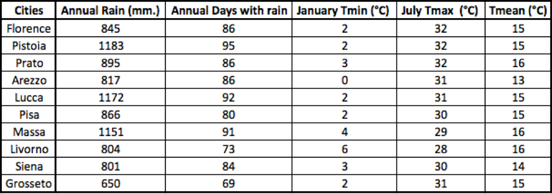

+++
title = "Maps from statistical data"
subtitle = ""

# Add a summary to display on homepage (optional).
summary = ""

date = 2019-03-15T12:20:19+01:00
draft = false

# Authors. Comma separated list, e.g. `["Bob Smith", "David Jones"]`.
authors = ['admin']

# Is this a featured post? (true/false)
featured = false

# Tags and categories
# For example, use `tags = []` for no tags, or the form `tags = ["A Tag", "Another Tag"]` for one or more tags.
tags = ["ScribbleMaps"]
categories = []

# Projects (optional).
#   Associate this post with one or more of your projects.
#   Simply enter your project's folder or file name without extension.
#   E.g. `projects = ["deep-learning"]` references
#   `content/project/deep-learning/index.md`.
#   Otherwise, set `projects = []`.
# projects = ["internal-project"]

# Featured image
# To use, add an image named `featured.jpg/png` to your page's folder.
[image]
  # Caption (optional)
  caption = "Image credit: [**ScribbleMaps*](https://www.scribblemaps.com/)"

  # Focal point (optional)
  # Options: Smart, Center, TopLeft, Top, TopRight, Left, Right, BottomLeft, Bottom, BottomRight
  focal_point = ""

  # Show image only in page previews?
  preview_only = true

  # Set captions for image gallery.
+++

Access to weather information has increased enormously. Anyone with a smartphone has an app to check weather forecasts for at any given moment.
On a daily basis, we are flooded with information on the internet, TV, and radio about climatic events such as:

* The first snowfall in New York;
* Milan's airport closing due to fog;
* Children and the elderly are asked to stay at home during the central hours of the day due to torrid weather.

Additionally, we often find reports that show the temperature fluctuation, wind speed variability, and precipitation amounts in cities.

Last week, we requested the annual average values gathered by the meteorological stations in the major cities of Tuscany.
Here is the excel report that we received.

We immediately thought about how to report this data in an interactive map so that we can make correlation analyses between the averages and the topographical features of the territory.

Scribble Maps helps us a lot in this. Thanks to the geocode service it will be simple to copy the data from the Excel sheet and paste them on the appropriate spreadsheet.
In just a few steps we got three heatmaps with georeferenced data through the geocode.

We put a topographic layer as a basemap, for example, google terrain.
We can easily see that the lowest temperatures are recorded in the mountainous areas while the highest temperatures are in the locations closest to the sea.
The rainiest areas are close to the mountain ranges.

We encourage you to replicate this analysis by taking other data from other weather stations in different regions or countries.

Students could look for their own region and study the data on a table of an excel sheet first, trying to establish the characteristics of the meteorological station by analyzing the three parameters (wind, rainfall, and temperature). After making their deductions it would be interesting to import the data into Scribble Maps to display them on a map and check if their assumptions were correct.

Furthermore, we want to recommend another use of the statistical data:
* You could also represent the life quality of major cities in the world. At this [link](https://www.kaggle.com/divrikwicky/quality-of-life), we found a ranking. Now we already know how to proceed!
We have copied and pasted the data and created the map with the markers containing the ranking associated with the city.

Do you have other statistical data to analyze? For example, data on crime? on smog? on poverty? Share your experiences with us.

